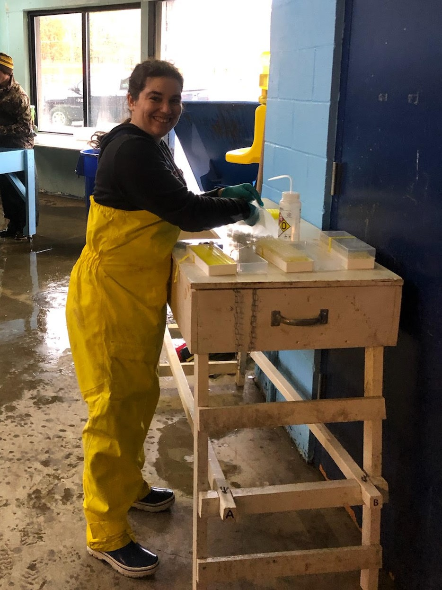

```{r setup, include=FALSE}
knitr::opts_chunk$set(echo = T)
```
-----


## **Kimberly Fitzpatrick **<br>


#### PhD Candidate <br>
Cornell University, [Dept. of Natural Resources and the Environment](https://cals.cornell.edu/natural-resources-environment)<br>
Email: kbf53@cornell.edu<br>
Twitter: [\@kbfitzpatrick](https://twitter.com/kbfitzpatrick)<br>
Google scholar [link](https://scholar.google.com/citations?user=etDM-cgAAAAJ&hl=en&oi=ao)<br>
Lab: [Sethi Lab](https://blogs.cornell.edu/sethilab/)<br>