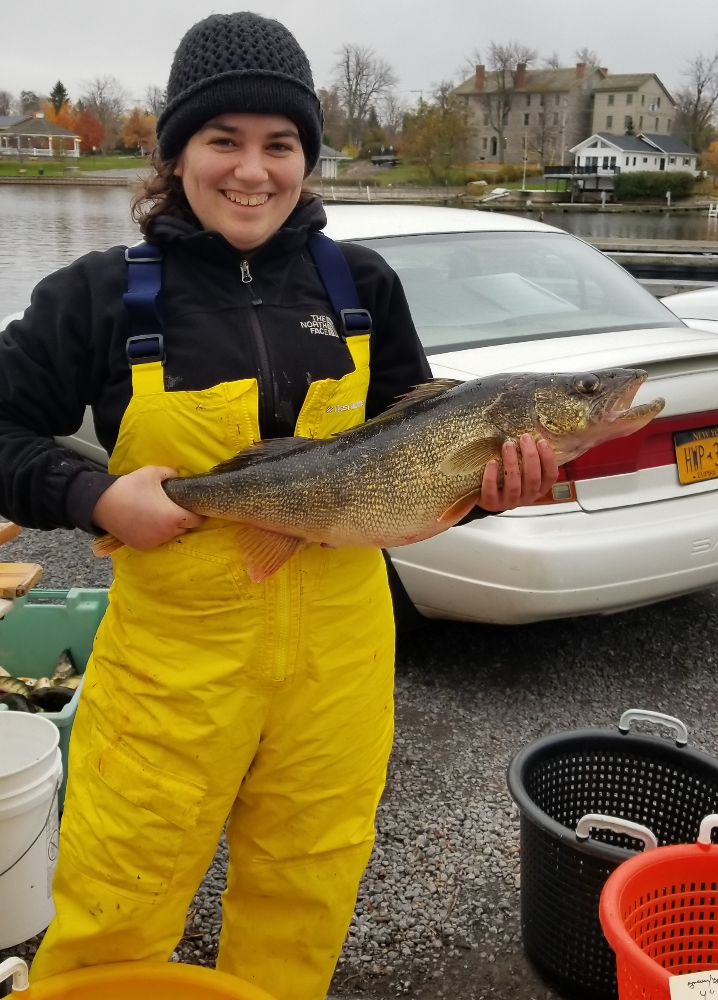

```{r setup, include=FALSE}
knitr::opts_chunk$set(echo = T)
```
-----


I am a quantitative ecologist with a focus on fisheries management and population dynamics.My research interests center on developing innovative statistical tools that leverage ecological dynamics to support resource-efficient fisheries assessments.

Currently, I am finishing up my Ph.D. in Natural Resources at Cornell University as part of the Sethi Lab and the New York Cooperative Research Unit. My Ph.D. research has involved working closely with fisheries managers and biologists to develop stock assessment tools for informing recreational fisheries management in Lake Ontario. Prior to Cornell, I received my M.S. in Geography from the University of Oklahoma while doing research on optimizing fish passage restoration and my B.S. in Marine Science from Eckerd College.
<br>

In my free time, I am an avid baker and particularly enjoy creating aquatic themed baked goods!
<br>

