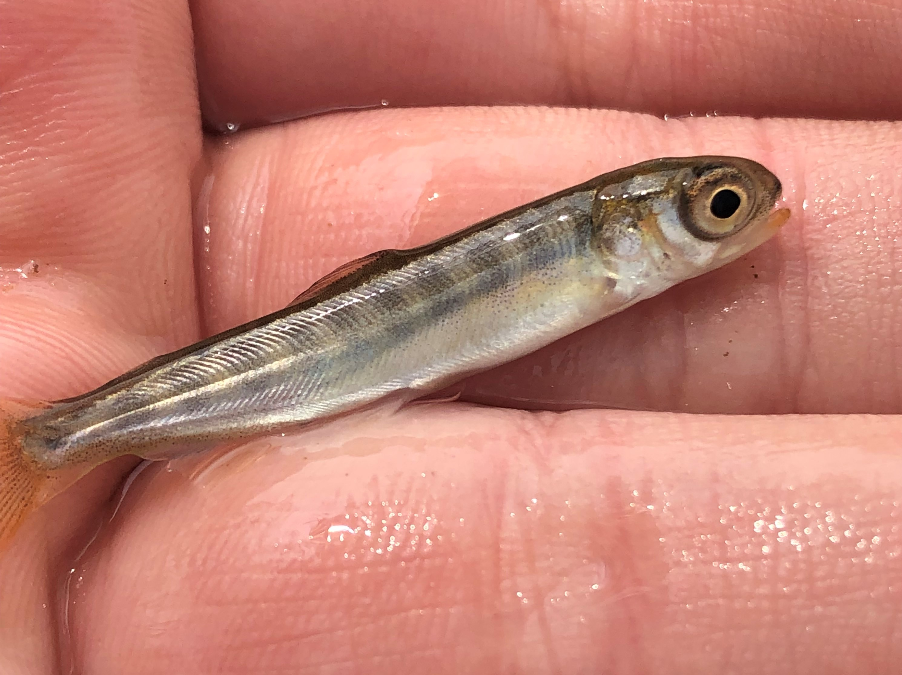
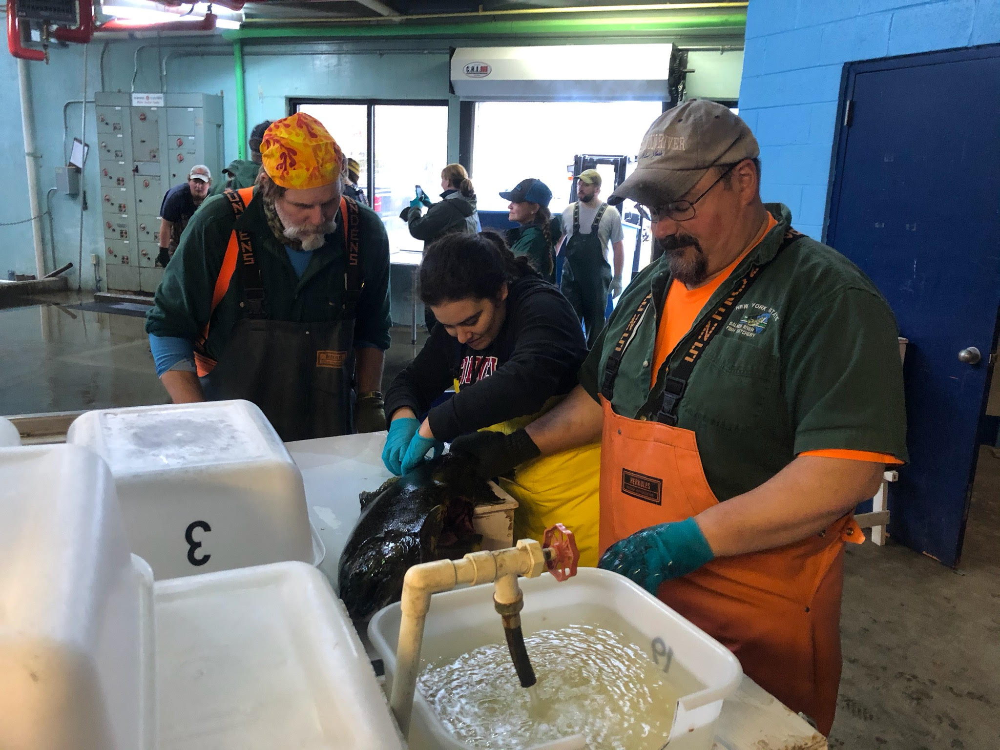

```{r setup, include=FALSE}
knitr::opts_chunk$set(echo = T)
```
<br>
<br>


### Multispecies Stock Assessments  

<br> There is growing awareness that incorporating ecosystem interactions directly into fisheries assessment models may improve estimates of species dynamics and predictions of future sustainability by incorporating the impact of ecological interactions on fishery productivity and sustainability. In the Laurentian Great Lakes, culturally and economically important recreational salmonine fisheries are known to be dependent on the continued availability of their primary prey item. In collaboration with regional managers and biologists, I developed a novel multispecies statistical catch-at-age model for two recreational fisheries (Chinook Salmon and Lake Trout) and their shared primary prey item (Alewife) in Lake Ontario. The model includes three population dynamics models linked together by predation and bioenergetics sub-models. Thus, the model is able to jointly estimate the dynamics of all three species and the amount of predation pressure on the prey population.

<b>Recent Publications</b>
<b>Fitzpatrick, K.B., </b> Weidel, B.C., Connerton, M.J., Lantry, J.R., Holden, J.P., Yuille, M.J., Lantry, B., LaPan, S.R., Rudstam, L.G., Sullivan, P.J., Brenden, T.O., Sethi, S.A. 2022. Balancing prey availability and predator consumption: a multispecies stock assessment for Lake Ontario. Canadian Journal of Fisheries and Aquatic Sciences. https://doi.org/10.1139/cjfas-2021-0126 

<br>

### Risk-Assessment and Projections of Future Fishery Sustainability
<br> 
<br>
Fisheries with tight linkages to other species through predator-prey or other trophic dynamics, multispecies analyses can provide critical insight into how management decisions and species interactions can influence future fishery sustainability. I am collaborating with Lake Ontario manages and biologists to use the multispecies model to develop short-term forecasts of predator-prey dynamics in response to varying ecological dynamics and management actions (predator stocking). We found that changes in stocking practices alone would be unable to substantially reduce prey mortality to reduce the probability of declines in prey fish biomass. These forecasts serve dual purposes of supporting current stocking decisions and highlighting data needs to informing future management decision making. We found that greater understanding of drivers Alewife and Chinook Salmon recruitment, including potential predation interactions between age-0 alewife and age-0 salmon, could improve our predictions of future predator-prey dynamics. 
 <br>
 
 <b>Recent Publications</b>
<b>Fitzpatrick, K.B., </b> Weidel, B.C., Connerton, M.J., Lantry, J.R., Holden, J.P., Yuille, M.J., Lantry, B., LaPan, S.R., Rudstam, L.G., Sullivan, P.J., Brenden, T.O., Sethi, S.A. 2022. Balancing prey availability and predator consumption: a multispecies stock assessment for Lake Ontario. Canadian Journal of Fisheries and Aquatic Sciences. https://doi.org/10.1139/cjfas-2021-0126 
 
### Resource-Efficent Monitoring Programs ###
<br>

Limited financial and personnel resources are a reality for management and conservation interests, and investment into one program often comes at the cost of other potential management and monitoring efforts. Thus, ideal monitoring programs are resource-efficent, inform management decision making,  and align with existing management protocols and procedures. Since 2018, I have been Working with NYSDEC and OMNDMNRF to develop a mass marking program for Chinook Salmon in Lake Ontario. I have led the pilot analysis of parentage-based tagging – genetically matching hatchery-raised offspring to their broodstock parents – in Lake Ontario and found that parentage-based tagging could be both a highly accurate and resource-efficient program for monitoring the dynamics of hatchery-origin and naturally reproduced Chinook Salmon in Lake Ontario. 

<br>
 <b>Recent Publications</b>
<b>Fitzpatrick, K.B.,</b> Overgaard Therkildsen, N., Marcy-Quay, B., Borchardt-Wier, H.B., Sethi, S.A. Discriminating between natural and stocked recruitment in inland fisheries using parentage-based tagging. In review at Fisheries Management and Ecology. <br>


### Spatial Ecology ###

While at the University of Oklahoma, my research evaluated the use of return-on-investment frameworks to guide freshwater connectivity restoration efforts. I created individual-based model to demonstrate how spatial optimization could maximize conservation outcomes for both stream-resident and migratory fisheries and, in collaboration with researchers from The Nature Conservancy and the University of Wisconsin-Madison, evaluated how indicator species could help guide restoration efforts in Great Lakes tributaries. 

<br>
 <b>Recent Publications</b>

<b>Fitzpatrick, K.B.,</b> Moody, A.T., Milt, A., Herbert, M.E, Khoury, M., Yacobson, E., Ross, J.A., Doran, P.J., Ferris, M.C., McIntyre, P.B., Neeson, T.M. 2021. Can indicator species guide conservation investments to restore connectivity in Great Lakes tributaries? Biodiversity and Conservation. 30: 165-182. https://doi.org/10.1007/s10531-020-02084-5 <br>
 
Neeson, T.M., Doran, P.J., Ferris, M.C., <b> Fitzpatrick, K.B., </b> Herbert, M., Khoury, M., Moody, A.T., Ross, J., Yacobson, E., McIntyre, P.B. 2018. Conserving rare species can have high opportunity costs for common species. Global Change Biology. 24(8): 3862-3872. https://doi.org/10.1111/gcb.14162 <br>

<b>Fitzpatrick, K.B., </b> Neeson, T.M. 2018. Aligning dam removals and road culvert upgrades boosts conservation return-on-investment. Ecological Modelling. 368: 198-204. https://doi.org/10.1016/j.ecolmodel.2017.11.018 <br>


